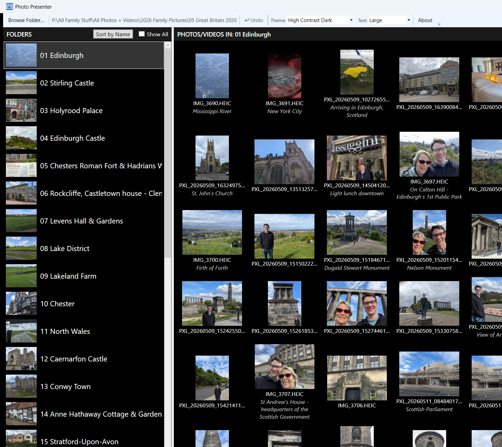

# PhotoPresenter

A Windows WPF application for presenting family photo and video collections on a TV. Browse and organise your media in one mode, then present it fullscreen in another.



## Features

### Organise Mode
- Browse a parent folder containing subfolders of photos and videos
- Drag and drop subfolders to set a custom presentation order
- Click **Sort by Name** in the Folders pane to sort all folders alphabetically (A→Z); a confirmation is shown before the saved order is updated
- Select a subfolder and drag and drop its items to reorder them
- Both panes support multi-selection: **Ctrl+Click** toggles an item, **Shift+Click** selects a range, **Ctrl+A** selects all; clicking empty space clears the selection
- Drag a selected item to move the entire selection together, preserving relative order
- **Delete** removes all selected items from the presentation at once
- Video files appear with a play-button thumbnail; the footer shows item counts as **x Items (y Photos, z Videos)**
- The Folders pane footer shows the folder count and aggregate photo, video, and total counts across all visible folders on a single line (e.g. **5 folders · 48 Photos, 7 Videos, 55 Total**)
- Right-click a folder or item and choose **Remove from Presentation** to exclude it — the actual files are never touched; with a multi-selection, the menu adapts: **Remove from Presentation** appears if any selected items are visible, **Add to Presentation** if any are hidden, or both if mixed — each action applies only to the applicable items
- Tick **Show All** in either pane to reveal removed items at reduced opacity; right-click a grayed item and choose **Add to Presentation** to restore it
- Right-click a folder and choose **Open Folder in Explorer** to open that folder in Windows File Explorer; the option is greyed out when multiple folders are selected
- Right-click any photo or video and choose **Open Folder in Explorer** to open its containing folder in Windows File Explorer; if one or more items are selected, those files are also pre-selected in Explorer
- Hover over a folder to see a tooltip showing the number of photos, videos, and total items in that folder
- Right-click any photo or video and choose **Open** to open it in its default app, or **Open With…** to choose another app; double-clicking a tile does the same as **Open**
- Hover over any photo or video tile to see a tooltip showing its type, date, dimensions (photos) or length (videos), and file size
- Right-click any photo or video and choose **Mirror** to horizontally flip it; right-click again and choose **Remove Mirror** to restore it; with a multi-selection, each item toggles independently — if states are mixed, both **Mirror** and **Remove Mirror** appear and apply only to the applicable items; the flip is shown on the thumbnail in Organise mode (photos) and applied during Present mode for both photos and videos; mirror state is saved to the sidecar and covered by undo
- Right-click any photo or video and choose **Add Caption** to attach a text caption; right-click again to **Edit Caption** or **Delete Caption**; with a multi-selection, these become **Set Caption** (writes the same caption to all selected items) and **Delete Caption** (removes captions from all that have one)
  - Press **Shift+Enter** in the caption dialog to insert a line break; the text box grows as lines are added
  - Multi-line captions are displayed centered in both Organise mode (below the thumbnail) and Present mode (overlaid at the bottom of the screen)
  - The caption dialog includes a built-in spellchecker — misspelled words are underlined in red; right-click a word to see correction suggestions
- **Ctrl+Z** or the **↩ Undo** toolbar button undoes the last action; up to 20 steps of history are kept — covers all reorders, removes, restores, sorts, and caption changes; a multi-select operation counts as one step; the history is cleared when a new folder is opened
- Thumbnails load on demand: folder-card thumbnails (left pane) load immediately on launch; photo thumbnails load when you click a folder, keeping startup fast even with thousands of files; decoded thumbnails are cached in `%LOCALAPPDATA%\PhotoPresenter\thumbcache\` so subsequent visits are near-instant
- Custom order and removed items are saved to small JSON sidecar files — your actual files and folders are never renamed or moved
- The app watches for external changes while it is running: if you rename a subfolder in Explorer, the new name appears immediately and the saved order is updated automatically; if a subfolder or photo is deleted externally, it is removed from the list and a brief notice appears; new photos copied into the selected folder appear automatically
- Click a folder (and optionally an item) before switching to Present mode to start from that point; press **F5** (or click **▶ Present**) to enter Present mode
- Window size, position, splitter position, selected folder, selected photo/video, both pane scroll positions, Show All checkbox states, and volume are all remembered between sessions
- Choose a **color theme** and **text size** independently from the toolbar dropdowns; both are remembered between sessions and take effect immediately without a restart
  - **Theme**: Light (default), Dark, High Contrast Light, High Contrast Dark, Slate Blue, Forest, Sunset, Amethyst, Teal
  - **Text**: Small, Normal (default), Large, Extra Large — applies to any theme

### Present Mode
- Fullscreen display on your TV or monitor
- Starts at the folder and item selected in Organise mode
- Clean black background, media fills the screen — no transitions, no effects
- Keyboard navigation:
  - **F5** — enter Present mode (also works from Organise mode)
  - **Right Arrow** — next item
  - **Space** — next photo; toggle play/pause for video
  - **Left Arrow** — previous item
  - Automatically moves between subfolders at boundaries
  - **Escape** — return to Organise mode
- Photo zoom and pan:
  - **+** / **-** — zoom in / out
  - **Scroll wheel** — zoom in / out
  - **Click and drag** — pan a zoomed image
- Video playback controls (shown at the bottom of the screen):
  - Scrub slider — drag to seek anywhere in the video
  - **↺** — restart from the beginning
  - **▶ / ⏸** — play / pause
  - Position display — current time and total duration (e.g. 0:23 / 3:16)
  - **↻ 90°** — rotate the video 90° clockwise; videos are auto-rotated on load using the orientation metadata written by phone cameras, so portrait videos display upright automatically
  - Volume slider
- If a video's audio codec is not supported by the Windows media infrastructure, the video still plays automatically and an amber banner appears at the top of the screen explaining that audio is unavailable; navigating to another item clears the banner

## Requirements

- Windows 10 or 11
- [.NET 8 Runtime](https://dotnet.microsoft.com/en-us/download/dotnet/8.0) (Desktop Runtime)

## Building from Source

Visual Studio 2022 with the **.NET desktop development** workload installed.

```
git clone https://github.com/cvmccoy1/PhotoPresenter.git
cd PhotoPresenter
dotnet build
```

Or open `PhotoPresenter.sln` directly in Visual Studio 2022 and press **F5**.

## How It Works

### Folder and photo order
When you reorder subfolders or photos in Organise mode, the order is saved to sidecar files:
- `_photofolderorder.json` in the parent folder — stores folder order and any removed folders
- `_photoorder.json` in each subfolder — stores photo order and any removed photos

If a sidecar file doesn't exist, folders are shown in alphabetical order and photos in date order. Items not listed in a sidecar (e.g. newly added photos) are appended at the end automatically.

### Captions
Captions are stored in each subfolder's `_photoorder.json` sidecar under a `captions` key. They are never written to the image files themselves.

### Removing and restoring items
Removing a folder or photo from the presentation adds its name to the `removed` list in the relevant sidecar file. It will be excluded from Organise and Present modes on the next launch. Tick **Show All** to see removed items and restore them individually at any time.

### External changes while the app is running
The app uses `FileSystemWatcher` to detect changes made outside the app while it is open:

| Change | What happens |
|--------|-------------|
| Subfolder renamed | Name updates live in the Folders pane; saved order is updated to match |
| Subfolder deleted | Folder disappears from the list; a brief notice appears at the top of the screen |
| New subfolder created | Appears at the bottom of the Folders pane |
| Photo or video added to the selected folder | Tile appears automatically |
| Photo or video deleted from the selected folder | Tile disappears |
| Photo or video renamed in the selected folder | Filename updates in place |

### Supported formats
**Photos:** JPG, JPEG, PNG, BMP, GIF, TIFF, HEIC, HEIF

HEIC/HEIF requires the free [HEIF Image Extensions](https://apps.microsoft.com/detail/9pmmsr1cgpwg) from the Microsoft Store.

**Videos:** MOV, MP4, AVI, WMV, M4V, MKV

Video playback uses the Windows media infrastructure. Most common formats work out of the box on Windows 10/11; some codecs (e.g. HEVC/H.265) may require the free [HEVC Video Extensions](https://apps.microsoft.com/detail/9nmzlz57r3t7) from the Microsoft Store.

## Project Structure

```
PhotoPresenter/
├── Models/          Pure data models
├── Services/        File I/O, folder scanning, settings persistence
├── ViewModels/      MVVM logic (CommunityToolkit.Mvvm)
└── Views/           XAML UI (MainWindow, OrganiseView, PresentView)
```

Built with [CommunityToolkit.Mvvm](https://github.com/CommunityToolkit/dotnet).
